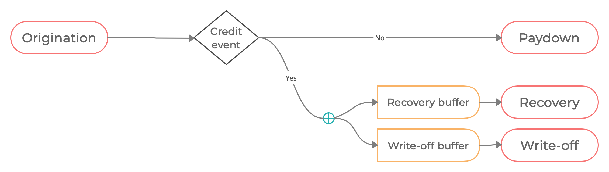
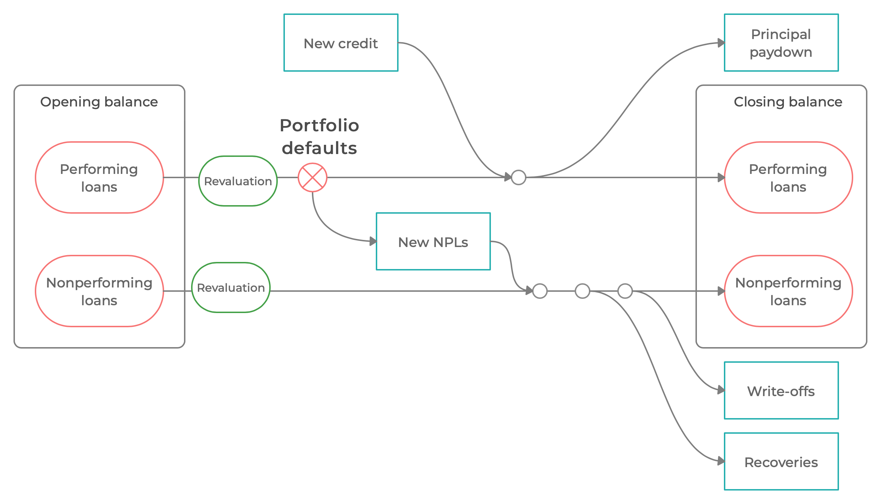

# Bank balance sheets and asset performance

![[title-page]]

$$
\newcommand{\xona}[1][t]{{ona}_{#1}}
\newcommand{\xrona}[1][t]{rona_{#1}}
\newcommand{\xy}{\mathit{y}}
\newcommand{\xyfwl}{\mathit{y}^\mathrm{fws}}
\newcommand{\xpy}{\mathit{py}}
\newcommand{\xny}{\mathit{ny}}
\newcommand{\xlcy}{\mathrm{lcy}}
\newcommand{\xhcy}{\mathrm{hcy}}
\newcommand{\xfcy}{\mathrm{fcy}}
\newcommand{\xxpvc}[1]{{\mathit{pvc}^0_{#1}}}
\newcommand{\xrepay}[1][t]{\theta_{lp}}
\newcommand{\xrepayk}[1]{\theta_{lp}^{#1}}
\newcommand{\xrecover}[1][t]{\theta_{lnc}}
\newcommand{\xrecover}[1][t]{\theta_{lnc}}
\newcommand{\xwoffdown}[1][t]{\theta_{lnw}}
\newcommand{\xrd}[1][t]{\mathit{rd}_{#1}}
\newcommand{\xrl}[1][t]{\mathit{rl}_{#1}}
\newcommand{\xrnewl}[1]{\mathit{rl}^{\Delta}_{#1}}
\newcommand{\xrlss}{\mathit{rl}}
\newcommand{\xl}[1][t]{\mathit{l}_{#1}}
\newcommand{\xlk}[2]{\mathit{l}_{#1}^{#2}}
\newcommand{\xd}[1][t]{\mathit{d}_{#1}}
\newcommand{\xdo}[2]{\mathit{d}^{0 #2}_{#1}}
\newcommand{\xnewl}[2]{\mathit{l}^{\Delta #2}_{#1}}
\newcommand{\xlp}[1][t]{\mathit{lp}_{#1}}
\newcommand{\xlpk}[2]{\mathit{lp}^{#2}_{#1}}
\newcommand{\xlpo}[2]{\mathit{lp}^{0 #2}_{#1}}
\newcommand{\xlc}[1][t]{\mathit{lc}_{#1}}
\newcommand{\xlco}[2]{\mathit{lc}^{0 #2}_{#1}}
\newcommand{\xle}[1][t]{\mathit{le}_{#1}}
\newcommand{\xln}[1][t]{\mathit{ln}_{#1}}
\newcommand{\xlno}[1][t]{\mathit{ln}^0_{#1}}
\newcommand{\xlo}[1][t]{\mathit{l}^{\,0}_{#1}}
\newcommand{\xlnc}[1][t]{\mathit{lnc}_{#1}}
\newcommand{\xlnco}[1][t]{\mathit{lnc}^0_{#1}}
\newcommand{\xlnw}[1][t]{\mathit{lnw}_{#1}}
\newcommand{\xlnwo}[1][t]{\mathit{lnw}^0_{#1}}
\newcommand{\xlgd}{\lambda}
\newcommand{\xclr}[1][t]{q_{#1}}
\newcommand{\xall}[1][t]{\mathit{a}_{#1}}
\newcommand{\xaf}[1][t]{\mathit{af}_{#1}}
\newcommand{\xab}[1][t]{\mathit{ab}_{#1}}
\newcommand{\xpvc}[1][t]{\mathit{pvc}_{#1}}
\newcommand{\xpvx}[1][t]{\mathit{pvx}_{#1}}
\newcommand{\xwoff}[1][t]{\mathit{w}_{#1}}
\newcommand{\xnewall}[2]{\mathit{a}_{#1}^{\Delta #2}}
\newcommand{\xdisc}[2]{\mathit{\delta}_{#1,#2}}
\newcommand{\xdiscxx}[2]{\mathit{\delta}_{#1,#2}^{**}}
\newcommand{\xbk}[1][t]{\mathit{bk}_{#1}}
\newcommand{\xnewbk}[1][t]{\mathit{bk}_{#1}^\Delta}
\newcommand{\xpie}[1][t]{\Pi_{#1}}
\newcommand{\xj}[1][t]{j_{#1}}
\newcommand{\xjl}[1][t]{jl_{#1}}
\newcommand{\xjd}[1][t]{jd_{#1}}
\newcommand{\xsigma}[1]{\sigma_{#1}}
\newcommand{\xe}[1][t]{e_{#1}}
\newcommand{\xemphk}{\color{red}{k}}
\newcommand{\xrbk}[1][t]{\mathit{rbk_{#1}}}
\newcommand{\xss}{\mathit{ss}}
\newcommand{\xrec}[1][t]{\mathit{rec}_{#1}}
\newcommand{\xcar}[1][t]{{car}_{#1}}
\newcommand{\xcartar}[1][t]{{car}_{#1}^{\mathrm{tar}}}
\newcommand{\xcarmin}[1][t]{{car}_{#1}^{\mathrm{min}}}
\newcommand{\xcarbfr}[1][t]{{car}_{#1}^{\mathrm{bfr}}}
\newcommand{\xrw}[1][t]{\mathit{rw}_{#1}}
\newcommand{\xtrn}[2]{\mathit{trn}^{\,#2}_{\,#1}}
\newcommand{\xvel}[2]{\mathit{vel}^{\,#2}_{\,#1}}
\newcommand{\xshock}[2]{\varepsilon_{#2,\, #1}}
\newcommand{\xk}{{\color{Apricot}{k}}}
\newcommand{\xrx}[1][t]{{rx}_{#1}}
\newcommand{\xnewln}[1][t]{ln^\Delta_{#1}}
\newcommand{\xnewlnk}[2]{ln^{\Delta #2}_{#1}}
\newcommand{\xlprec}[1][t]{lp^\mathrm{rec}_{#1}}
\newcommand{\xlpreco}[1][t]{lp^{0\, \mathrm{rec}}_{#1}}
\newcommand{\xlnrec}[1][t]{ln^\mathrm{rec}_{#1}}
\newcommand{\xlnreco}[1][t]{ln^{0\, \mathrm{rec}}_{#1}}
\newcommand{\xonfx}[1][t]{\mathit{onfx}_{#1}}
\newcommand{\rec}{\mathrm{rec}}
\notag
$$

--------------------------------------------------------------------------------

### Simplified aggregate bank balance sheets

The model explicitly describes balance sheet of the aggregate banking
sector in the following form:

| | Assets | | Liabilities | |
|:---|:---|---|---:|---:|
| $\xle$ | Net loans | | Non-equity liabilities | $\xd$ |
| $+\ \sum \xl^{\,k}$ | $+$ Gross loans | | $+$ Local currency    | $+\ d_t^{\,\xlcy}$ |
| $-\ \sum \xall^k$ | $-$ Allowances for CL | | $+$ Foreign currency | $+ \ d_t^{\,\xfcy}$|
| $\xona$ | Other net assets | | Balance sheet capital |$bk_t$|

* Bank loans can be denominated in local or foreign currency

* Non-equity liabilities $\xd$ include deposits as well as other sources of
  financing.

* All allowances here assumed to be contra-assets, and netted against gross
  exposure values before risk weighting.

--------------------------------------------------------------------------------

## Multiperiod loans with geometric paydown

--------------------------------------------------------------------------------

### Motivation 

* Real-world loan portfolios include a whole range of loan durations
  (maturities)

* Stock-flow relationships between the stock of credit and new credit
  critical for the cost of deleveraging process

* Need to simplify to keep the model tractable, but still maintain key
  features of the real-world

* Assume a composite portfolio of loans with geometrically decreasing
  paydowns[^1]

    * Represents a mix of durations

    * Needs one single parameter

    * Has a recursive representation 

    * Calibrated using Macaulay duration

[^1]: For instance, Rudebusch and Swanson (2008) Examining the bond premium puzzle with a DSGE model. JME 55 (2008), S111--S126

--------------------------------------------------------------------------------

### Lifetime of a single riskless pool

Each hypothetical loan follows the same life-cycle:

|                           | Origination   | Time 1                                        | Time 2    | ... |
|---                        |:---:          |:---:                                          |:---:      |---  |
|Closing book value         | $\xl[]$       | $\left(1-\theta\right) \xl[]$        | $\left(1-\theta\right)^ 2 \xl[]$ | ... |
|Paydown                    |               | $\theta\  \xl[]$              | $\theta \left(1-\theta\right) \xl[]$ | ... |
|Interest                   |               | $\xrl[0] \, \xl[]$              | $\xrl[1] \left(1-\theta\right) \xl[]$ | ... |
|Total cash flow generated  |               | $\left(\theta + \xrl[0] \right) \xl[]$ | $\left(\theta+\xrl[1]\right)\left(1-\theta\right) \xl[0]$ | ... |

Parameter $\theta$ determines the average maturity of the loan portfolio,
and can be calibrated using e.g. Macaulay duration.

The effective interest rate on the stock of outstanding loans (stock rate),
$\xrl$ may vary over time and be disconnected from $\theta$ in
general.

--------------------------------------------------------------------------------

### Calibrating loan duration

Steady-state [Macaulay duration](https://en.wikipedia.org/wiki/Bond_duration)

$$
MD \quad =\quad 1\cdot \frac{\theta + \xrlss}{1 + \xrlss} \quad +\quad 2\cdot \frac{\left(\theta + \xrlss\right) \left(1-\theta\right) }{\left(1 + \xrlss\right)^ 2} \quad + \quad \cdots \quad = \frac{1+\xrlss}{\theta+\xrlss}
$$

--------------------------------------------------------------------------------

### Time evolution of a dynamic riskless loan portfolio

**Dynamic** here means inclusive of the inflow of new loans.

Assuming no credit events and no exchange rate valuation, the loan
portfolio evolves as:

$$
\xl = (1 - \theta) \xl[t-1] + \xnewl{t}{ }
$$

where $\xnewl{t}{ }$ is the amount of new loans extended in time $t$. 

Time $t$ cash flows (paydown + interest) generated by the loan portfolio collected at $t$:

$$
\xl[t-1] \left( \theta + \xrl[t-1] \right)
$$

--------------------------------------------------------------------------------

## Credit risk and loan performance

--------------------------------------------------------------------------------

### Credit events

* Introduce a theoretical structure that is simple enough to remain analytically tractable

* Make losses proportional not to the book value but the present value $\longrightarrow$ simplify present value calculations (e.g. IFRS9
  expected credit loss)[^2]

[^2]: For instance, Duffie and Singleton (1999) Modeling Term Structure of Defaultable Bonds. *The Review of Financial Studies*, 12(4).

**Static** snapshot of possible paths for a given loan

--------------------------------------------------------------------------------

### Classification of gross loans

Gross loans are classified either as **performing** or **nonperforming**.

$$
\xl = \xlp + \xln
$$

Non-performing loans break down into a recovery buffer (to be gradually recovered, i.e. generating cashflows), $\xlnc$, and a write-off buffer (to be gradually written-off), $\xlnw$ 
$$
\xln = \xlnc + \xlnw
$$

This is a simplification for modeling purposes. Do not think of individual loans as being classified as $\xlnc$ or $\xlnw$; rather the book value of each loan is split between these two categories on default. The recoverable amount is not known on default in real-world setting, but we simplify.

Total pool of loans generating cash flows

$$
\xlc = \xlp + \xlnc
$$

--------------------------------------------------------------------------------

###  Flows in gross loan portfolio

| Portfolio division | Cash Flows | Credit event |
|--- |--- |--- |
| Performing $\xlp$ | Paydown, interest | (outflow) $\xnewln=\xclr \ \xlpo{t}{} \to$ |
| Nonperforming recovery buffer $\xlnc{}$ | Collections, repossession, resale | (inflow) $\to (1-\xlgd)\ \xnewln$ |
| Nonperforming writeoff buffer $\xlnw{}$ | None | (inflow) $\to \xlgd\ \xnewln$ |

where

* $\xnewln$ is the amount of loans that experience a credit event and become non-performing in time $t$

* $q$ is the share of performing loans experiencing a credit event (default)

* $\lambda$ is parameter governing the share of the newly non-performing loans which falls into the write-off buffer $\xlnw$

--------------------------------------------------------------------------------

### Stock-flow dynamics in risky loan portfolio

--------------------------------------------------------------------------------

### Time evolution of dynamic risky loan portfolio

Assuming no exchange rate valuation in all that follows below

#### Performing loans

**Closing** balance rolled over from previous time $t-1$ 

$$
\xlp[t-1]
$$

Balance after **new information** at new time $t$: new information (defaults) arrives,
adjust the balance for new information

$$
\begin{gathered}
\xlpo{t}{}=\xlp[t-1] - \xnewln \\[10pt]
\xnewln = q_t \ \xlp[t-1]
\end{gathered}
$$

**Throughout-period** cash flows generated by the performing loans: paydown
plus interest income

$$
\left( \xrepay[t-1] + \xrl[t-1] \right) \, \xlpo{t}{}
$$

**Closing** balance after paydown and inclusive of new credit $\xnewl{t}{}$

$$
\xlp=(1-\xrepay[t-1]) \, \xlpo{t}{} + \xnewl{t}{}
$$

#### Nonperforming loans: Recovery buffer

**Closing** balance rolled over from previous time $t-1$ 

$$
\xlnc[t-1]
$$

Balance after **new information** at new time $t$: new information
(defaults) arrives, adjust the balance for new information

$$
\xlnco = \xlnc[t-1] + (1-\xlgd) \, \xnewln
$$

**Throughout-period** cashflow generated by the recovery buffer 

$$
\xrec \, \xlnco
$$

The recovery rates are mimicked by hypothetical paydowns $\xrecover$ (may
be different from $\xrepay$) and interest payments; this assumption is to 

* distribute the collections, repossession of collateral and/or resale over
  time 

* preserve the net present value equal the current book value (that is why
  we include the interest payments) as a simplifying assumption

$$
\xrec = \xrecover[t-1] + \xrl[t-1]
$$

**Closing** balance after recovery cash flows

$$
\xlnc=(1-\xrecover) \, \xlnco
$$

#### Nonperforming loans: Write-off buffer

**Closing** balance rolled over from previous time $t-1$ 

$$
\xlnw[t-1]
$$

Balance **after new information** at new time $t$: new information arrives, adjust the balance for new information

$$
\xlnwo=\xlnw[t-1] + \xlgd \ \xnewln
$$

**Throughout-period** write-offs

$$
\xwoff 
$$

**Closing** balance 

$$
\xlnw=\xlnwo - \xwoff
$$

--------------------------------------------------------------------------------

## Provisioning and write-offs

--------------------------------------------------------------------------------

### Provisioning

The stock of allowances, $\xall$, is determined by expected credit losses; the balancing item here is the impact of changes in allowances on period profit/loss after correction for write-offs

$$
\xall = \xall[t-1] - \xwoff + \xnewall{t}{ }
$$

* $\xall$ is the stock of allowances for expected credit losses

* $\xwoff$ is period write-offs (flow)

* $\xnewall{t}{ }$ is the impact of new provisions (flow) on period profit/loss

Here, the assumption is that no matter our provisioning scheme, the write-off buffer has 100% coverage.

--------------------------------------------------------------------------------

### Write-off process

Write off a certain proportion of the exiting buffer each period

$$
\xwoff = \omega \cdot \xlnw[t-1]
$$

* $\omega \in (0, \, 1)$ is a parameter determining the speed of the write-off process

* $\xlnw[t-1]$ is the write-off buffer balance at the close of last period

--------------------------------------------------------------------------------

## Segmentation and valuation

--------------------------------------------------------------------------------

### Portfolio segmentation

Consider total gross loans consisting of a number $K$ of segments (subportfolios, subclasses), each differing in its

* risk parameters

* responsiveness to macroeconomic conditions

* share of foreign exchange denomination

$$
\xl = \xl^ 1 + \cdots + \xl^ K = \sum_ {k=1}^ K \xl^ k
$$

Each loan segment is tracked separately. Equations presented above exist in $K$ variants for each loan segment separately.

--------------------------------------------------------------------------------

### Exchange rate valuation

For practical modeling:

* We introduce an effective (nominal) exchange rate that would be
  sufficiently representative of movements on foreign currency denominated
  asset classes

* All balance sheet quantities will be expressed (reported, tracked) in
  *local currency units* independently of their currency of *denomination*

--------------------------------------------------------------------------------

### Parameterizing foreign currency denomination

For each loan segment, we define the steady-state degree of foreign exchange denomination (exposure) by $\xsigma{k}\in[0,\,1]$:
$$
\sigma_k = \frac{l^{k, fcy}_t}{l^k_t}
$$

* $\xsigma{k}=0$ means fully home currency denomination

* $\xsigma{k}=1$ means fully foreign currency denomination

* $0<\xsigma{k}<1$ means mixed currency denomination

The loan portfolio segment $l^{k}$ is adjusted for exchange rate valuation whenever crossing a time period using the following exchange rate valuation impact indicator (depending on the parameter $\sigma_k$)
$$
j^k_t = (1- \sigma_k) + \sigma_k \, \frac{\xe}{\xe[t-1]} 
= 1 + \sigma_k \left( \frac{\xe}{\xe[t-1]} - 1\right)
$$

--------------------------------------------------------------------------------

### Time evolution of foreign currency denominated loan segments

**Closing** balance from previous time $t-1$ 

$$
\xlp[t-1]^{\xemphk}
$$

Balance after new information at a new time $t$: new information arrives **including the new level of the exchange rate**  adjust the balance for new
information

$$
\begin{align*}
\xnewlnk{t}{\xemphk} &= j^{\xemphk}_t \ \xclr \ \xlp[t-1]^{\xemphk} \\ 
\xlpo{t}{\xemphk} &= j^{\xemphk}_t \ \xlp[t-1]^{\xemphk} - \xnewlnk{t}{\xemphk}
\end{align*}
$$

Period cash flows generated by the portfolio: paydown plus interest income

$$
\left( \xrepay[t-1]^ {\xemphk} + \xrl[t-1]^ {\xemphk}  \right) \xlpo{t}{\xemphk}
$$

Closing balance after paydown and inclusive of new lending

$$
\xlp^ {\xemphk}=(1-\xrepay[t-1]^ {\xemphk} ) \xlpo{t}{\xemphk} +
\xnewl{t}{\xemphk}
$$

--------------------------------------------------------------------------------

### Open net foreign positions

Part of the non-equity liabilities is denominated in foreign currency:

$$
\xd = \xd^{\,\xlcy} + \xd^{\,\xfcy}
$$

The banks can have open net foreign positions, expressed as a share of capital:

$$
\xd^{\,\xfcy} = \sum_ {k=1}^ K  \xl^{\,k}\cdot \xsigma{k} + \xonfx \cdot \xbk
$$

and $\xonfx$ is an exogenou process around its steady-state value

$$
\xonfx = \rho_{\xonfx} \, \xonfx[t-1]
+ (1 - \rho_{\xonfx}) \, \xonfx[\xss]
+ \varepsilon_{\xonfx,t}
$$

--------------------------------------------------------------------------------

