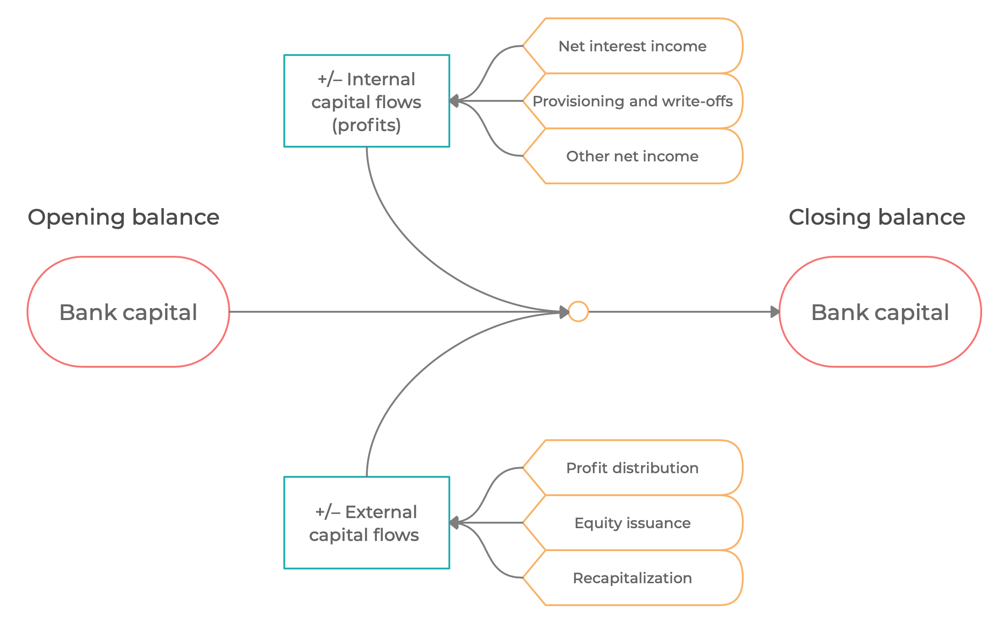

# Bank capital and capital regulation

![[title-page]]

$$
\newcommand{\xona}[1][t]{{ona}_{#1}}
\newcommand{\xrona}[1][t]{rona_{#1}}
\newcommand{\xy}{\mathit{y}}
\newcommand{\xyfwl}{\mathit{y}^\mathrm{fws}}
\newcommand{\xpy}{\mathit{py}}
\newcommand{\xny}{\mathit{ny}}
\newcommand{\xlcy}{\mathrm{lcy}}
\newcommand{\xhcy}{\mathrm{hcy}}
\newcommand{\xfcy}{\mathrm{fcy}}
\newcommand{\xxpvc}[1]{{\mathit{pvc}^0_{#1}}}
\newcommand{\xrepay}[1][t]{\theta_{lp}}
\newcommand{\xrepayk}[1]{\theta_{lp}^{#1}}
\newcommand{\xrecover}[1][t]{\theta_{lnc}}
\newcommand{\xrecover}[1][t]{\theta_{lnc}}
\newcommand{\xwoffdown}[1][t]{\theta_{lnw}}
\newcommand{\xrd}[1][t]{\mathit{rd}_{#1}}
\newcommand{\xrl}[1][t]{\mathit{rl}_{#1}}
\newcommand{\xrnewl}[1]{\mathit{rl}^{\Delta}_{#1}}
\newcommand{\xrlss}{\mathit{rl}}
\newcommand{\xl}[1][t]{\mathit{l}_{#1}}
\newcommand{\xlk}[2]{\mathit{l}_{#1}^{#2}}
\newcommand{\xd}[1][t]{\mathit{d}_{#1}}
\newcommand{\xdo}[2]{\mathit{d}^{\,0 #2}_{#1}}
\newcommand{\xnewl}[2]{\mathit{l}^{\Delta #2}_{#1}}
\newcommand{\xlp}[1][t]{\mathit{lp}_{#1}}
\newcommand{\xlpk}[2]{\mathit{lp}^{#2}_{#1}}
\newcommand{\xlpo}[2]{\mathit{lp}^{0 #2}_{#1}}
\newcommand{\xlc}[1][t]{\mathit{lc}_{#1}}
\newcommand{\xlco}[2]{\mathit{lc}^{0 #2}_{#1}}
\newcommand{\xle}[1][t]{\mathit{le}_{#1}}
\newcommand{\xln}[1][t]{\mathit{ln}_{#1}}
\newcommand{\xlno}[1][t]{\mathit{ln}^0_{#1}}
\newcommand{\xlo}[1][t]{\mathit{l}^{\,0}_{#1}}
\newcommand{\xlnc}[1][t]{\mathit{lnc}_{#1}}
\newcommand{\xlnco}[1][t]{\mathit{lnc}^0_{#1}}
\newcommand{\xlncok}[2][t]{\mathit{lnc}^{0\,#2}_{#1}}
\newcommand{\xlnw}[1][t]{\mathit{lnw}_{#1}}
\newcommand{\xlnwo}[1][t]{\mathit{lnw}^0_{#1}}
\newcommand{\xlgd}{\lambda}
\newcommand{\xclr}[1][t]{q_{#1}}
\newcommand{\xall}[1][t]{\mathit{a}_{#1}}
\newcommand{\xpvc}[1][t]{\mathit{pvc}_{#1}}
\newcommand{\xpvx}[1][t]{\mathit{pvx}_{#1}}
\newcommand{\xwoff}[1][t]{\mathit{w}_{#1}}
\newcommand{\xnewall}[2]{\mathit{a}_{#1}^{\Delta #2}}
\newcommand{\xdisc}[2]{\mathit{\delta}_{#1,#2}}
\newcommand{\xdiscxx}[2]{\mathit{\delta}_{#1,#2}^{**}}
\newcommand{\xbk}[1][t]{\mathit{bk}_{#1}}
\newcommand{\xnewbk}[1][t]{\mathit{bk}_{#1}^\Delta}
\newcommand{\xpie}[1][t]{\Pi_{#1}}
\newcommand{\xj}[1][t]{j_{#1}}
\newcommand{\xjl}[1][t]{jl_{#1}}
\newcommand{\xjd}[1][t]{jd_{#1}}
\newcommand{\xsigma}[1]{\sigma_{#1}}
\newcommand{\xe}[1][t]{e_{#1}}
\newcommand{\xemphk}{\color{red}{k}}
\newcommand{\xrbk}[1][t]{\mathit{rbk_{#1}}}
\newcommand{\xss}{\mathrm{ss}}
\newcommand{\xrec}[1][t]{\mathit{rec}_{#1}}
\newcommand{\xcar}[1][t]{{car}_{#1}}
\newcommand{\xcartar}[1][t]{{car}_{#1}^{\mathrm{tar}}}
\newcommand{\xcarmin}[1][t]{{car}_{#1}^{\mathrm{min}}}
\newcommand{\xcarbfr}[1][t]{{car}_{#1}^{\mathrm{exc}}}
\newcommand{\xcarexc}[1][t]{{car}_{#1}^{\mathrm{exc}}}
\newcommand{\xrw}[1][t]{\mathit{rw}_{#1}}
\newcommand{\xtrn}[2]{\mathit{trn}^{\,#2}_{\,#1}}
\newcommand{\xvel}[2]{\mathit{vel}^{\,#2}_{\,#1}}
\newcommand{\xshock}[2]{\varepsilon_{#2,\, #1}}
\newcommand{\xk}{{\color{Apricot}{k}}}
\newcommand{\xrx}[1][t]{{rx}_{#1}}
\newcommand{\xnewln}[1][t]{ln^\Delta_{#1}}
\newcommand{\xnewlnk}[2]{ln^{\Delta #2}_{#1}}
\newcommand{\xlprec}[1][t]{lp^\mathrm{rec}_{#1}}
\newcommand{\xlpreco}[1][t]{lp^{0\, \mathrm{rec}}_{#1}}
\newcommand{\xlnrec}[1][t]{ln^\mathrm{rec}_{#1}}
\newcommand{\xlnreco}[1][t]{ln^{0\, \mathrm{rec}}_{#1}}
\newcommand{\xonfx}[1][t]{\mathit{onfx}_{#1}}
\newcommand{\xprof}[1][t]{\mathit{prof}_{#1}}
\newcommand{\xxcf}[1][t]{\mathit{xcf}_{#1}}
\newcommand{\xriskw}[1][t]{\mathit{riskw}_{#1}}
\newcommand{\xregk}[1][t]{\mathit{bg}_{#1}}
\newcommand{\xfnc}[1][t]{\mathit{fnc}_{#1}}
\notag
$$

--------------------------------------------------------------------------------

### Overview

__Bank capital__

* Balance sheet capital accumulation
* Internal and external capital flows
* Regulatory capital

__Internal and external capital flows__ 

* Components of period profit/loss
* External flows

__Capital adequacy and bank behavior__

* Regulatory capital
* Target capital levels

__Feedback to bank lending__

* Regulatory capital shortfall
* Nonlinear cost of bank capital

--------------------------------------------------------------------------------

### Bank capital accumulation

--------------------------------------------------------------------------------

### Bank capital accumulation

$$
\xbk = \xbk[t-1] + \xprof + \xxcf
$$

* $\xbk$ is bank capital (balance sheet capital)

* $\xprof$ is an internal flow of capital (retained profit or loss, PnL) recorded on the closing balance of the balance sheets at $t-1$ and credit events throughout $t$

* $\xxcf$ is an external flow of capital throughout $t$: dividends paid out (–), new equity issuance (+), equity withdrawals by parents (–), recapitalization flows (+), etc.

--------------------------------------------------------------------------------

### Internal capital flows (Period profit/loss)

Components of period profit/loss

* Interest income on loans (by segments)
* Income on other assets
* Interest expense on non-equity liabilities (by currency of denomination)
* Provisioning and write-offs
* Exchange rate valuation
* Other net income (proxy for fees, commissions, labor costs, etc.)

$$
\begin{aligned}
\xprof &= \sum  \xrl[t-1]^{\,k} \left( \xlpo{t}{k}
+ \xlncok[t]{k} \right) 
\\[10pt] & +\ \xrona[t-1]\, \xona[t-1] 
% \\[10pt] & + \xfnc \ \xnewl{t}{k}
\\[10pt] & -\ \xrd[t-1]^{\,\xlcy}\xdo{t}{\,\xlcy}-\xrd[t-1]^ {\,\xfcy}\xdo{t}{\,\xfcy}
\\[10pt] & -\ \sum \left( a_t^k - a_{t-1}^k + w_t^k \right)
\\[10pt] & +\ \sum \xl[t-1]^{\,k}\left(j_t-1\right) \ -\ \xd[t-1]^{\,\xfcy}\,\left( \frac{\xe}{\xe[t-1]} - 1 \right) \\[10pt]
& +\ c_1 \cdot tna_{t-1}
\end{aligned}
$$

--------------------------------------------------------------------------------

### External capital flows

Switch between two extreme cases

* $c_1 \to 0$ External capital flows do not respond to fluctuations in
  capital adequacy ratio. Bank owners do not adjust external flows (e.g.
  dividends) based on the current profit/loss at all.

* $c_1 \to 1$ External capital flows bring capital adequacy ratio to its
  target level at all times. Bank owners adjust external flows (e.g. cut
  dividends, add capital) to always ensure $\xcar = \xcartar$.

$$
\left(1 - c_1\right)\left(
\left[ \frac{\xxcf[]}{\xbk[]} \right]_t -
\left[ \frac{\xxcf[]}{\xbk[]} \right]_\xss
\right) -
c_1 \left( \xcar - \xcartar \right) = 0
$$

--------------------------------------------------------------------------------

### Regulatory capital and CAR

* Balance sheet capital, $bk_t$, and regulatory capital, $bg_t$, differ in
  their definitions and reporting standards

* Either use a mechanical reconciliation process (as is here) or model the
  details of the differences

 

__Regulatory capital__

$$
\xregk = \left[ \frac{\xregk[]}{\xbk[]} \right]_t \ \xbk
$$

__Standard capital adequacy ratio__

$$
\xcar = \frac{\xregk}{\xriskw \cdot \left[ \left(\xl - a_t\right) + ona_t \right]}
$$

* $\xriskw$ is the effective average risk weight, an exogenous variable

--------------------------------------------------------------------------------

### Comfort (target) levels of CAR

In equilibrium (steady state), banks target a comfort level of CAR

$$
\xcar \longrightarrow \xcartar
$$

$$
\xcartar = \xcarmin + \xcarexc
$$

where

* $\xcarmin$ is the regulatory minimum including regulatory buffers

* $\xcarexc$ is the excess capital target above the regulatory minimum
  targeted by banks. Banks are motivated to hold excess capital to avoid
  approaching regulatory minimum in case of unexpected adverse shocks.

--------------------------------------------------------------------------------

### Feedback to bank lending

__Capital adequacy risk surcharge__

Negative shocks can push the the actual CAR $car_t$ below the optimal level
$car^{tar}$. If $\xcar$ approaches regulatory minimum $\xcarmin$, capital
shortfall triggers increase in capital adequacy risk surcharge $rx_t$. The
surcharge is added to the lending rates as the bank attempts to increase
profitability as well as reduce lending to shrink its balance sheet.

* $\xcar < \xcartar$ Tighter lending conditions: Increase spreads, reduce leverage

* $\xcar > \xcartar$ Lax lending conditions: Reduce spreads, expand balance sheets

--------------------------------------------------------------------------------

### Functional form of risk surcharge

The risk surcharge is a non-linear function of the distance to regulatory
capital shortfall (distance to $\xcarmin$)

$$
\xrx = \underline{\xrx[]}
+ \left(\overline{\xrx[]} - \underline{\xrx[]}\right)
\left[ 1  + \exp -\frac{\xcar - \xcarmin - \mu}{\sigma} \right] ^ { - \exp \nu }
$$

| Parameter       |  Meaning                                                      |
| --------------- |  ------------------------------------------------------------ |
| $\mu$ | Location parameter: moves the curve left or right |
| $\sigma$         | Scale parameter: makes the curve steeper/flatter             |
| $\nu$            | Shape parameter: makes the curve asymmetric, heavy left/heavy right |
| $\underline rx$  | Lower bound                                                  |
| $\overline rx$   | Upper bound                                                  |

--------------------------------------------------------------------------------

