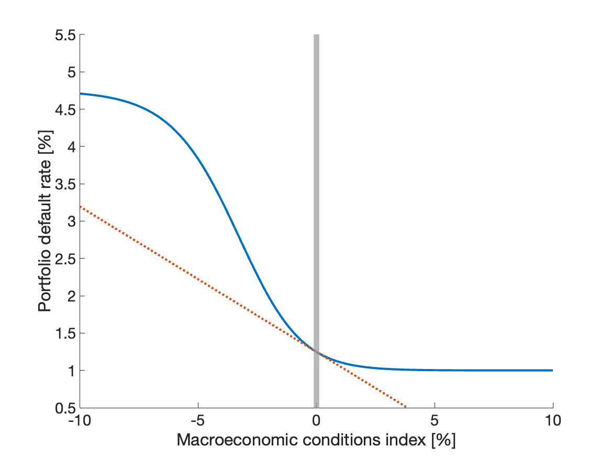

# Credit risk

![[title-page]]

$$
\newcommand{\xtnd}{\mathrm{tnd}}
\newcommand{\xcdot}{\,\cdot\,}
\notag
$$

--------------------------------------------------------------------------------

### Feedback through credit risk

Credit risk creates several types of feedback linkages in the model:

* Current credit events impair loan performance: allowances, write-offs, losses, capital deterioration

* Expected credit risk gets priced in new lending rates/conditions

* Capital adequacy stress gets priced in new lending rates/conditions

* Unexpected risk (i.e. value at risk between expected risk and a particular percentile) is buffered in regulatory capital

* Macro conditions trigger credit events: nonlinear mapping of current and expected macro conditions into credit events

### Summary of credit risk feedback elements

| Credit risk feedback element              | Module |
|---                                                |---            |
| Credit events $\rightarrow$ Loan performance | Bank loan performance |
| Expected risk $\rightarrow$ Lending conditions | Bank interest rates |
| Capital adequacy stress $\rightarrow$ Lending conditions | Bank capital |
| Macro conditions $\rightarrow$ Credit events   | Credit risk connector |
| Lending conditions $\rightarrow$ Output and forex | Local macro economy |

--------------------------------------------------------------------------------

### Credit risk function

* Implicitly based on Basel asymptotic single risk factor approach

* Mapping from a macro conditions index, $z_t$, (a single composit factor) into
  a portfolio default rate, $q_t$

$$
q_t = f(z_t)
$$

 

* Sign and location conventions for $z_t$:

| Value | Meaning |
|---|---|
| $z_t=0$ | Macroeconomic and macrofinancial steady state |
| $z_t>0$ | Better than average times | 
| $z_t<0$ | Worse than average times |

--------------------------------------------------------------------------------

### Places where the portfolio default rates enter the model

* Actual performance of the existing loan portfolio

* Expected credit risk used in pricing new loans

--------------------------------------------------------------------------------

### Key properties of credit risk function

* Nonlinear and asymmetric

* Around normal times, the credit risk function can be safely approximated
  as a linear function

* Large distress leads to disproportionately larger deterioration in loan
  performance

* Conversely, exceptionally good times reduce defaults to a much smaller
  extent

* Lower and upper bounds different from $[0,\, 1]$: Autonomous defaults,
  technical maximum

--------------------------------------------------------------------------------

### Example shape

--------------------------------------------------------------------------------

### Functional form

* Five-parameter generalized logistic function

$$
f(z_t) \equiv
\underline q + \left(\overline q - \underline q\right) \left[ \frac{1}{1 + \exp-\frac{z-\mu}{\sigma} } \right]^{\exp\nu}
$$

| Parameter | Meaning |
|-----------|---------|
| $\mu$ | Location: moves the curve left-right |
| $\sigma$ | Scale: makes the curve steeper/flatter |
| $\nu$ | Shape: makes the curve asymmetric |
| $\underline q$ | Lower bound |
| $\overline q$ | Upper–lower bound spread |

--------------------------------------------------------------------------------

### Macro conditions index

The portfolio segment specific macro conditions index combines

* **current** macro performance: output gap

* borrower **vulnerability**: annualized credit (loans) to GDP ratio

Constructed as a weighted average of (percent/percentage point) deviations from the long-run sustainability trends

$$
z_t \ =\ 
( 1 - c_1) \
\Bigl( \log y_t - \log \overline y_t \Bigr)
\ - \ c_1 \left( 
\left[ \tfrac{l}{4 \xcdot py \xcdot fwy} \right]_t 
- \left[ \tfrac{l}{4\xcdot py \xcdot y}\right]^\xtnd_t
\right)
$$

--------------------------------------------------------------------------------

