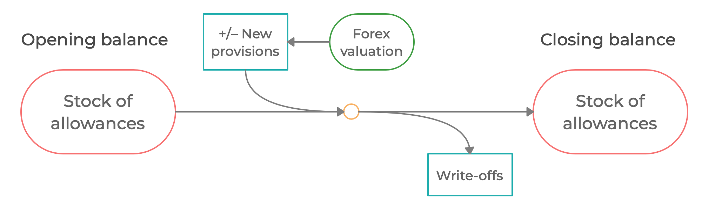

# Provisioning

![[title-page]]

--------------------------------------------------------------------------------

### Expected and unexpected losses

* Allowances (contra-asset) to cover expected losses (mean values)

* Capital (equity) to cover so-called unexpected losses

--------------------------------------------------------------------------------

### Lending spreads, credit risk and allowances

In theory, the expected credit losses are covered fully by the lending
spread if priced correctly $\to$ allowances would not be needed.

In the real world

* Lending spreads are far from being priced to fully/perfectly accommodate true risk: partly mismeasurement/misjudgment, partly a deliberate choice by banks (strategic behavior)

* Fixed rate loans cannot be repriced with new information arriving and expected loss revisions

* Observed (market) lending rates do not sufficiently compensate for expected credit losses

--------------------------------------------------------------------------------

### Two types of allowances

Two types of allowances are considered in the model

* incurred loss (IL) based (backward-looking) allowances, $\xab$
* expected loss (EL) based (forward-looking) allowances, $\xaf$

The __IL allowances__, $\xab$ are based on the actual performance of the exposures. The allowances are built according to the downturn risk parameters (PD, LGD, EAD) proportional to the volume of the nonperforming loans and performing loans.

The conceptual definition of the __EL allowances__, $\xaf$, is the difference between 

* the present value of contractual cashflows; and

* and the present value of the expected cashflows (considering the expectations of credit events)

with both of these evaluated for the current (static) pool of loans.

---

### IL-based allowances

Most IL-based provisioning schemes are based on downturn risk parameters, separately for performing and nonperforming loans

$$
ab_t = ab^{ln}_t + ab^{lp}_t
$$

$$
\begin{gather}
ab^{ln}_t = \mathit{pd}^{\,ln}\cdot \mathit{lgd}^{\,ln}\cdot ln_t \\[10pt]
ab^{lp}_t = \mathit{pd}^{\,lp}\cdot \mathit{lgd}^{\,lp}\cdot lp_t
\end{gather}
$$

---

### Formal definition of EL-based allowances in the model

$$
a_t = \text{PV of Contractual Cash Flows}\ -
\text{PV of Expected Cash Flows}
$$

Because the write-off buffer, $\xlnw$, has no recovery at all, the allowances can be expressed as

$$
\xall = \xpvc \, \xl - \left( \xpvx  \xlp + \xlnc \right)
$$

where 

* $\xpvc$ is the PV of contractual cashflows of a unit sized portfolio of loans

* $\xpvx$ is the PV of expected cashflows of a unit sized portfolio of loans

Note that the PV of the recovery buffer of NPLs is exactly equal to its book value by assumption (see the Time evolution of dynamic risky portfolio)

### Present value of contractual cash flows

Present value of contractual cash flows from a static pool of unit size (dropping the expectations operator) is given by the sum of discounted expected future cashflows:

$$
\begin{aligned}
\xpvc & = \xdisc{t}{t+1} \left( \xrepay + \xrl \right) \\[5pt]
& +\ \xdisc{t}{t+2} \left( 1 - \xrepay \right) \left( \xrepay + \xrl[t+1] \right) \\[5pt]
& +\ \xdisc{t}{t+3} \left( 1 - \xrepay \right)^ 2 \left( \xrepay + \xrl[t+2] \right) \\[5pt]
& +\ \cdots
\end{aligned}
$$

with the discount factors are given by

$$
\begin{gathered}
\xdisc{t}{t+1} = \frac{1}{1 + \xrl} \\[5pt]
\xdisc{t}{t+2} = \xdisc{t}{t+1} \, \xdisc{t+1}{t+2} = \frac{1}{(1+\xrl)(1+\xrl[t+1])} \\[5pt]
\dots
\end{gathered}
$$

Recursive formula

$$
\xpvc = \xdisc{t}{t+1} \left[ \left( \xrepay + \xrl \right) + (1-\xrepay) \xpvc[t+1] \right]
$$

Easy to show that $\xpvc = 1$ no matter what. 

### Present value of expected cash flows

Present value of expected cash flows from a static pool of unit size (dropping the expectations operator) takes into account also probability and impact of credit events:

$$
\begin{aligned}
\xpvx &= \xdiscxx{t}{t+1}  \left( \xrepay + \xrl \right) \ +\ \xdiscxx{t}{t+2} \left( 1 - \xrepay \right) \left( \xrepay + \xrl[t+1] \right) \cdots \\[5pt]
&+\  (1-\lambda) \, \xclr[t+1] \cdot 1\ +\ \xdiscxx{t}{t+1} \, (1-\lambda) \, \xclr[t+2] \cdot 1 + \cdots
\end{aligned}
$$

where the first row is the present value of cashflows associated with the performing part of the loan portfolio whereas the second row is the present
value to be recovered on the nonperforming part of the portfolio (turning nonperforming at the beginning of period $t+1$, period $t+2$, etc.)

The discount factors used in the $\xpvx$ calculations are given by

$$
\xdiscxx{t}{t+1} = \frac{1 - \xclr[t+1]}{1 + \xrl}, \qquad\qquad
\xdiscxx{t}{t+2} = \xdiscxx{t}{t+1} \, \xdiscxx{t+1}{t+2} = \frac{(1 - \xclr[t+1])(1 - \xclr[t+2])}{(1 + \xrl)(1+\xrl[t+1])},
\qquad\qquad \text{etc}\dots
$$

Recursive formula

$$
\xpvx = \xdiscxx{t}{t+1} \left[ \xrepay + \xrl + (1-\xrepay) \, \xpvx[t+1] \right] \ + (1-\ \lambda)\,\xclr[t+1]
$$

Easy to show that $\xpvx < 1$ as long as $\xlgd \, \xclr[t] > 0$

### Steady-state present value of expected cash flows

Along a steady-state path, even if loan volumes are growing, the present value of expected cash flows from a unit portfolio remains constant as long
as $\xrl$, $\xrepay$, $\xclr$, and $\xlgd$ remain constant
$$
\xpvx[\mathit{ss}] = \frac
{\left(1-\xclr[\xss]\right)\left(\xrepay+\xrl[\xss]\right) + \xlgd \, \xclr[\xss] }
{ 1 + \xrl[\mathit{ss}] - \left( 1 - \xclr[\mathit{ss}] \right) \left(1 - \xrepay \right) }
$$

