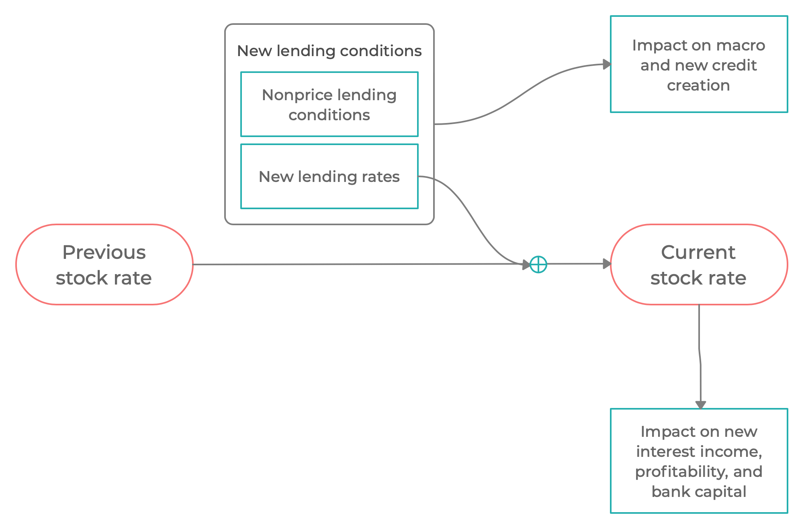
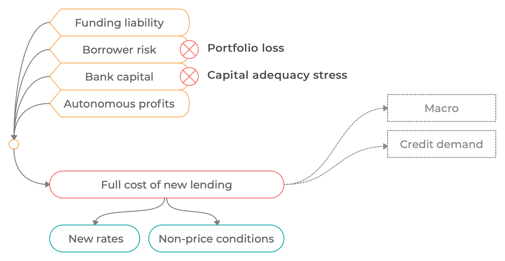

# Lending and funding rates

![[title-page]]

$$
\newcommand{\loan}{l}
\newcommand{\xnewrd}[1][t]{rd^\Delta_{#1}}
\newcommand{\xnewrlone}[1][t]{rl^{\Delta s1}_{#1}}
\newcommand{\xrl}[1][t]{rl_{#1}}
\newcommand{\xrd}[1][t]{rd_{#1}}
\newcommand{\xrs}[1][t]{\mathit{rs}_{#1}}
\newcommand{\psirl}{\psi_{rl}}
\newcommand{\lp}[1][t]{\loan p_{#1}}
\newcommand{\lpo}[1][t]{\loan p^0_{#1}}
\newcommand{\newl}[1][t]{\loan^\Delta_{#1}}
\newcommand{\xicr}{\mathrm{icr}}
\newcommand{\xnewrlbase}[1][t]{rl^{\Delta\xbase}_{#1}}
\newcommand{\xnewrdbase}[1][t]{rd^{\Delta\xbase}_{#1}}
\newcommand{\xnewrlicr}[1][t]{rl^{\Delta\xicr}_{#1}}
\newcommand{\xpvcbase}[1][t]{pvc^\xbase_{#1}}
\newcommand{\xpvxbase}[1][t]{pvx^\xbase_{#1}}
\newcommand{\xpvpbase}[1][t]{pvp^\xbase_{#1}}
\newcommand{\xpvnbase}[1][t]{pvn^\xbase_{#1}}
\newcommand{\xrlapm}[1][t]{rl_{#1}^\mathrm{apm}}
\newcommand{\xpsirl}[1][t]{\psi_{rl}}
\newcommand{\xnewrlfull}[1][t]{rl^{\Delta\xfull}_{#1}}
\newcommand{\xss}{\mathrm{ss}}
\newcommand{\xfull}{\mathrm{full}}
\newcommand{\xbase}{\mathrm{base}}
\newcommand{\xfcy}{\mathrm{fcy}}
\newcommand{\xlcy}{\mathrm{lcy}}
\newcommand{\xapm}{\mathrm{apm}}
\newcommand{\xnewrl}[1][t]{rl^\Delta_{#1}}
\notag
$$

--------------------------------------------------------------------------------

### Stock-flow dynamics in lending rates

--------------------------------------------------------------------------------

### Stock-flow relationship in lending rates

Each period, a lending rate on newly issued credit ("new lending rate") $\xnewrl[t]$ is determined by the banks based on a cost-plus loan pricing mechanism described below. The new lending rate then applies to a certain proportion, $\psirl$, of the stock of pre-existing outstanding loans (i.e. these loans are repriced), and to all new loans. This is to mimick the fact that the total loan portfolio comprises loan contracts with different interest fixation periods. The duration of interest fixation differs in general, from the duration of the respective individual loans themselves. Depending on the parameter $\psirl$, we can choose any point between the following two limit cases to describe the average lending rate fixation period within a portfolio segment:

* $\psirl=0$: the duration of the lending rate fixation matches exactly the duration of the underlying loan (a **fixed rate** loan) for each loan in the portfolio
  
* $\psirl=1$: the lending rate is fully adjustable on the underlying loan (an **adjustable rate** loan) for each loan in the portfolio

The effective rate that determines the interest income on the stock of outstanding loans, called the stock lending rate, $\xrl$, is given by
$$
\xrl = 
\left(1 - \Omega_t\right) \cdot \xrl[t-1] + \
\Omega_{t}\cdot \xnewrl[t] 
$$

where $\Omega_{t} \in \left(0, \ 1 \right]$ is a (time-varying) share of new lending rates in the updated effective stock rates

$$
\Omega_{t} = \frac{ \psirl \, (1-\theta) \, \lpo + \newl}{\lp}
$$

and is given by the proportion of the performing loan portfolio, $\lp$, to which the new rate applies, consisting of a $\psirl$ fraction of the existing loans and all
the new loans.

--------------------------------------------------------------------------------

### Lending rates in real world

New lending rates affected by the anticipation of three types of risks

* **Interest rate risk**: today's and future changes in short term rates
  may make the funding costs of fixed rate contracts increase

* **Borrower credit risk**: today's and future credit events (changes in
  frequency of) may reduce profits from the contracts

* **Bank capital adequacy risk**: today's and future likelihood of
  regulatory capital shortfall, capital stress

For a number of reasons, these two types of risks are not always passed
through on to lending rates fully.

The observed lending rates typically only reflect the anticipated risks
partially.

The remaining part of the risk (that is not priced in the lending rates) is
expressed in (unobservable) new non-price lending conditions.

--------------------------------------------------------------------------------

### Forward-looking cost-plus loan pricing

--------------------------------------------------------------------------------

### Forward-looking cost-plus loan pricing

The new lending rates respond to four components of bank costs

| Cost components |
| ------------------------------------------------------------ |
| Marginal funding cost including short rate risk over LRF[^1] |
| Borrower credit risk premium over LRF[^1] |
| Endogenous profit margin to cover cost of bank capital (balance sheet stress) |
| Autonomous profit margin to cover other unmodeled cost drivers |

[^1]: Lending rate fixation

--------------------------------------------------------------------------------

### Expected funding costs depending on lending rate fixation

The lending rate fixation period is approximated at a portfolio segment
level using the average lending rate fixation period $\xpsirl$.

**Short-term base rate**

The short term base rate derives from the money market (or policy) rate, depending on the LCY vs FCY denomination of the respective portfolio segment:

$$
r_t^{\Delta\xbase} = (1-\sigma) \ r_t + \sigma \ rw_t
$$

**Cost component 1: Short-term rate risk and credit risk**

The hypothetical lending rate covering the full credit risk is given by
$$
1 + rl^{\Delta 1}_t = 
(1-\Psi)\ \mathrm E_t \biggl[ \ 
\frac{1 + rl_t^{\Delta\xbase}}{1 - \lambda \ q_{t+1}}
\ +\ \Psi\ \frac{1 + rl_{t+1}^{\Delta\xbase}}{1 - \lambda \ q_{t+2}}
\ +\ \Psi^2\ \frac{1 + rl_{t+2}^{\Delta\xbase}}{1 - \lambda \ q_{t+3}}
+ \ \cdots\ 
\Bigr] 
$$

where
$$
\Psi \equiv \left( 1 - \psi_{rl} \right) \left( 1 - \theta \right)
$$

is the effective discount factor applied on each future base cost

**Cost component 2: Bank capital cost**

The cost of bank capital (capital shortfall stress) is also reflected in loan pricing given by

$$
1 + rl^{\Delta 2}_t = 
(1-\Psi)\ \mathrm E_t \Bigl[ \
(1 + rx_t)
+\ \Psi\ (1 + rx_{t+1})
+\ \Psi\ (1 + rx_{t+2})
+ \ \cdots \
\Bigr] 
$$

 

**Cost component 3: Autonomous profit margins**

Exogenous process $rl_t^{\Delta\mathrm{arm}}$

 

**Hypothetical new lending rate covering all costs**

$$
1 + rl^{\Delta \xfull}_t = (1 + rl^{\Delta \xfull,1}_t) \cdot (1 + rl^{\Delta \xfull,2}_t) \cdot (1 + rl^{\Delta \mathrm{arm}}_t)
$$

 

--------------------------------------------------------------------------------

##### Price and non-price lending conditions

The hypothetical full-cost rate $rl^{\Delta \xfull}_t$ splits into

* a price component, i.e. the actually observed new lending rate;

* non-price conditions measured by an interest rate equivalent and passed on to borrowers)

    

The extraction of the price component is based on the spread over the base rate. Parameter $c_1$ controls what share of risk is reflected in the price components as opposed to the non-price conditions:

$$
\xnewrl = \xnewrlbase \
+\ c_1 \left( \xnewrlfull - \xnewrlbase \right)
+\ \left(1-c_1\right) \left( \xnewrlfull[\xss] - \xnewrlbase[\xss] \right)
$$

 

The hypothetical full-cost rate $\xnewrlfull$ enters the aggregate demand and credit demand equations, as it represents the true cost of credit for borrowers. 

The observed lending rate $\xnewrl$ enters the bank profits calculations.

--------------------------------------------------------------------------------

### Stock-flow relationship in funding rates

The effective rate that determines the interest expense on the stock of
non-equity liabilities, called the stock funding rate, $\xrd$, is given by
$$
\xrd = 
\left(1 - \psi_{rd} \right) \cdot \xrd[t-1] + 
\psi_{rd} \cdot \xnewrd[t] 
+ \epsilon_{\xrd[],t}
$$

where $\psi_{rl} \in \left(0, \ 1 \right]$ is the effective impact of new funding rates on the stock rates, and is parameterized as an exogenous number.

--------------------------------------------------------------------------------

### New funding rates

The new funding rates are set as a markdown (with a parameterized autonomous profit margin, $rd^\mathrm{apm}$) below the short-term cash rate 

$$
rd^\Delta_t = r_t - rd^\xapm_t
$$

